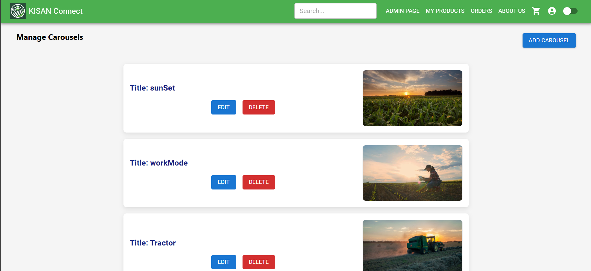

# Carousels Management 🎠

The **Carousels Management** section enables the **Admin** to manage the carousels displayed on the platform's homepage. The admin can **view**, **edit**, and **add** carousels, as well as **delete** carousels.

### Features:
1. **View All Carousels**  
   - The admin can **view all the existing carousels**, which will be listed with buttons to **edit** or **delete** each carousel.  
   - Clicking the **delete** button will **remove the carousel** from the homepage, ensuring the carousel content is kept up to date.

   

2. **Edit Carousel**  
   - The admin can **edit** the carousel to update its content, such as changing the image or title 
   - This feature ensures that carousels remain up-to-date with fresh content.

   

3. **Add Carousel**  
   - The admin can **add a new carousel** by clicking the **Add Carousel** button.  
   - New carousel items can include images, titles.

   

---

This system ensures that the admin can effectively manage carousels on the homepage, keeping the content dynamic and engaging for users.
