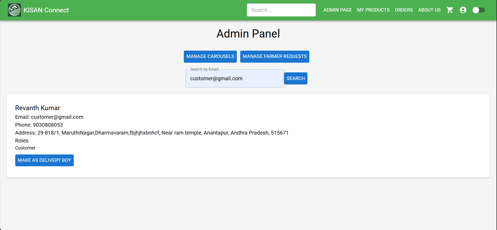

# Delivery Boy Management 🚚

The **Delivery Boy Management** section allows the **Admin** to manage delivery boys on the platform by adding or removing them based on their email addresses.

### Features:
1. **Add Delivery Boy**  
   - The admin can **add a new delivery boy** to the platform by providing their **email address** and basic details. This allows new delivery boys to start receiving orders.

2. **Remove Delivery Boy**  
   - The admin can **remove a delivery boy** by entering their **email address**, ensuring that only authorized and active delivery personnel are available on the platform.

---

This management system allows the admin to efficiently control who is listed as a delivery boy on the platform, ensuring smooth operations for deliveries.
