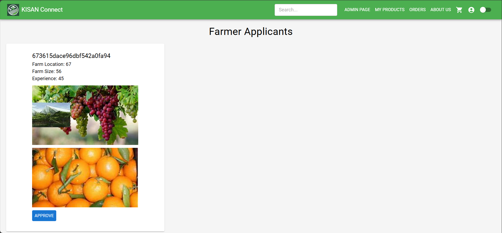

# Farmer Requests Page 🌾

The **Farmer Requests** page allows the **Admin** to manage incoming requests from customers who wish to become farmers on the platform. The admin can **approve** or **reject** requests based on the criteria.

### Features:
1. **View All Farmer Requests**  
   - The admin can **view all requests** from customers who wish to become farmers. Each request will be listed with an **Approve** button.  

2. **Approve Request**  
   - When the **Approve** button is clicked, the customer's request will be **approved**, and they will be granted **Farmer** status, allowing them to list and manage their agricultural products on the platform.  
   - Once approved, the customer can switch to the **Farmer interface** and begin managing their products.

   

---

This feature ensures that only valid and verified users are approved to sell products on the platform, keeping the marketplace reliable and organized.
