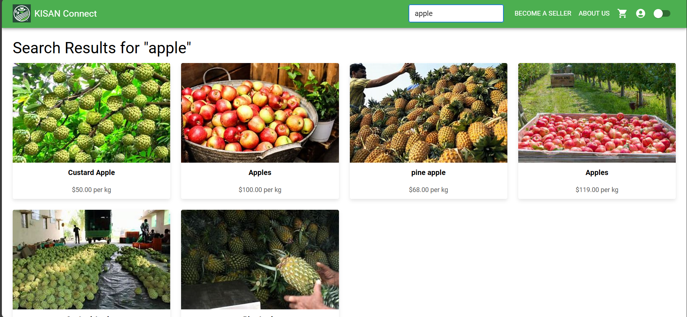
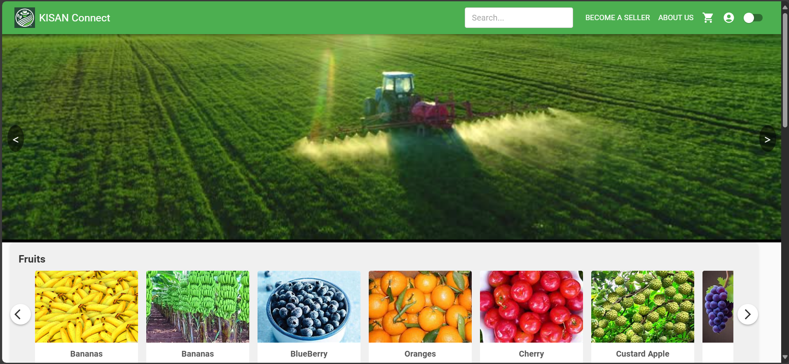
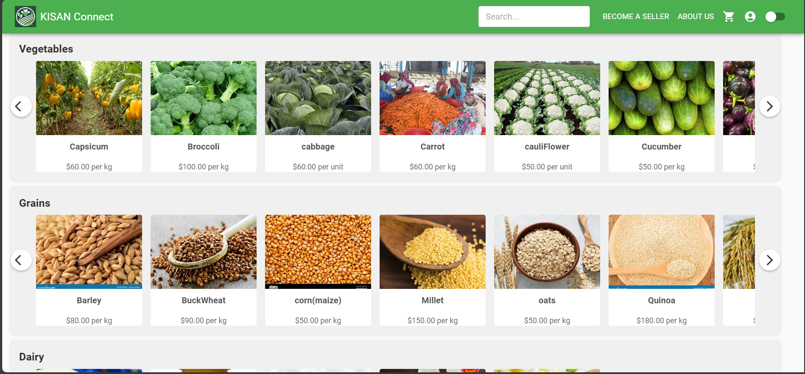
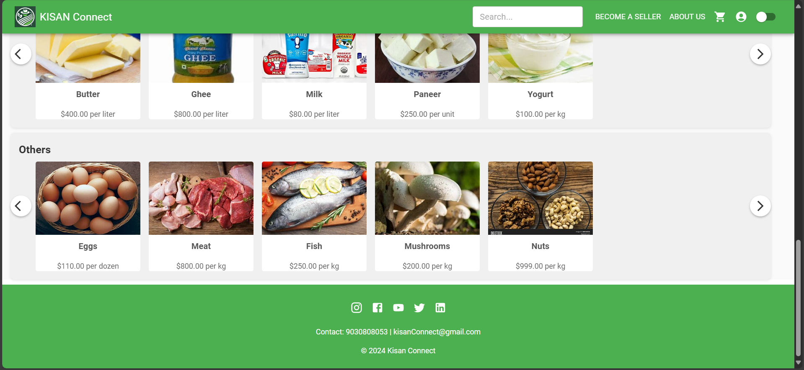

# Home Screen 🏠

The **Home Screen** provides customers with a user-friendly interface to explore products dynamically. It includes essential features to enhance usability and convenience.

---

## Features

### 1. Navbar  
- A clean and intuitive navbar at the top of the screen.  
- Includes a **dark mode/light mode toggle button** for a personalized experience.  

### 2. Search Bar  
- A search bar at the top below the navbar.  
- Allows users to quickly search for their desired products by name or category.  

  

### 3. Carousels  
- Dynamic carousels showcasing promotional offers, seasonal products, or featured items.  
- These carousels are managed and updated by the Admin for a fresh experience.  

  

### 4. Product Rows  
- Five categories of products are displayed in **horizontally scrollable rows**:  
  - Fruits  
  - Vegetables  
  - Dairy  
  - Grains  
  - Others  

- Each row allows users to **click on a product** to view its images, description, and additional details.  

  

### 5. Footer  
- A clean footer at the bottom of the page.  
- Contains links to **About Us**, **Contact**, and **Terms & Conditions** pages.  

---

This page ensures a seamless browsing experience for customers, making it easy to explore and engage with the platform.
