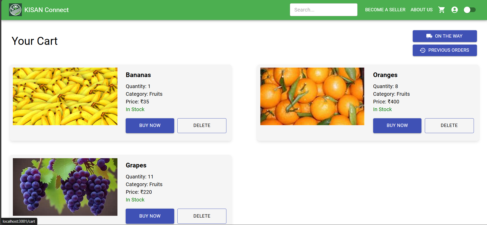
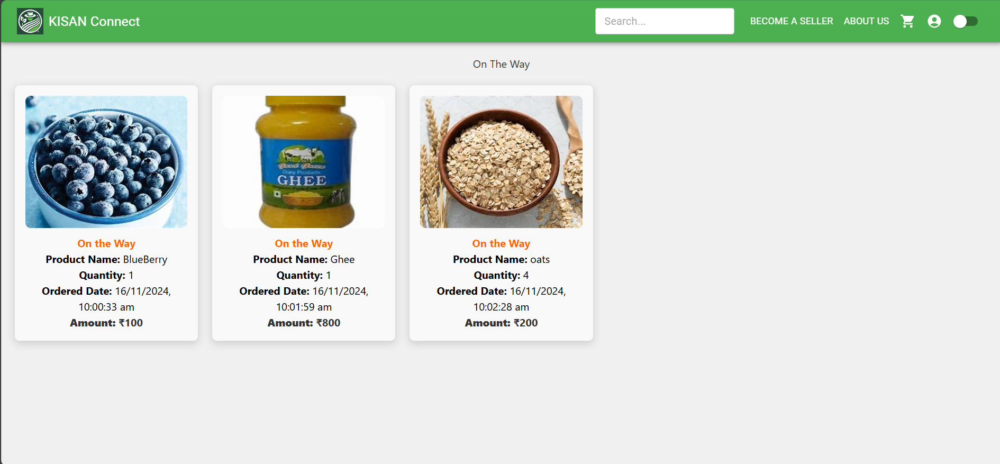
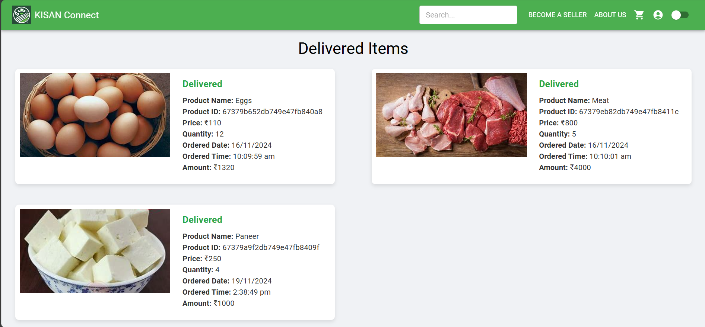

# My Orders 📦

The **My Orders** page provides customers with a simple way to track their shopping experience, from adding items to the cart, to viewing items that are on the way, and finally, delivered items. 

---

## Pages

### 1. **Cart Page**  
- Displays all the items that the customer has added to their cart.  
- Allows customers to review their items before proceeding to checkout.  

  

### 2. **On the Way Page**  
- Shows items that have been ordered but are still in transit.   

  

### 3. **Delivered Page**  
- Displays items that have been successfully delivered to the customer.  
- Shows confirmation of delivery and may include delivery details.  

  

---

This section allows customers to easily track and manage their orders through different stages, ensuring a smooth and organized shopping experience.
