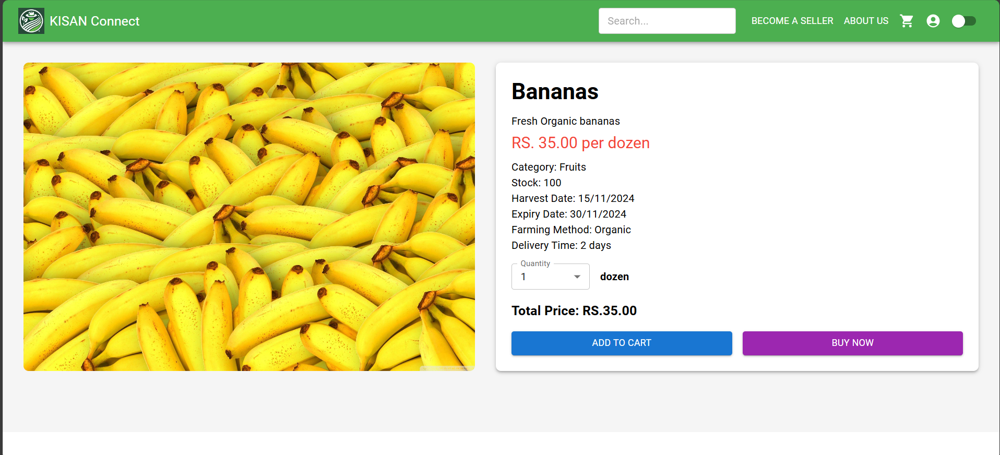
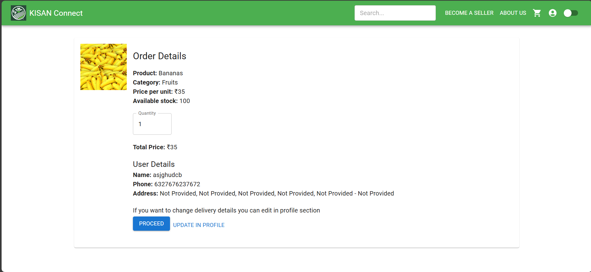

# Product 🛒

The **Product** page allows customers to explore detailed information about specific items, add them to the cart, or proceed to buy them directly.

---

## Pages

### 1. **Product View**  
- Displays comprehensive details about the selected product.  
- Includes images, description, price, and options for adding the product to the cart or buying it directly.  
- Click on "Add to Cart" to add the product to the customer's shopping cart.  
- Click on "Buy Now" to proceed to the confirmation page and complete the purchase.  

  

### 2. **Buy Now Page**  
- Appears when a customer opts to buy a product directly.  
- Allows customers to review the order summary and confirm the purchase.   

  

---

These pages facilitate an easy and straightforward shopping experience, ensuring customers can make informed purchasing decisions with minimal steps.
