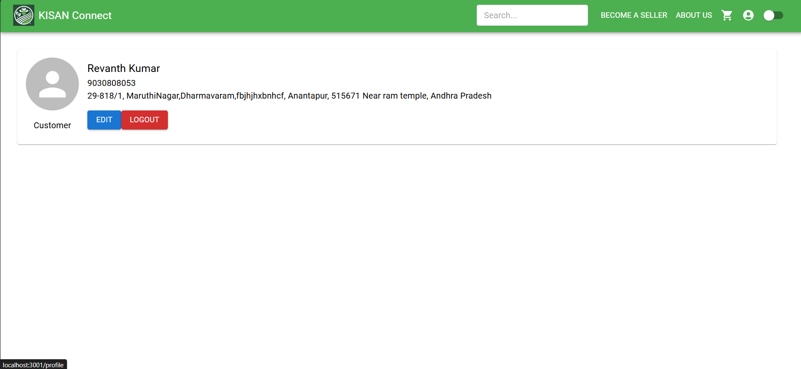
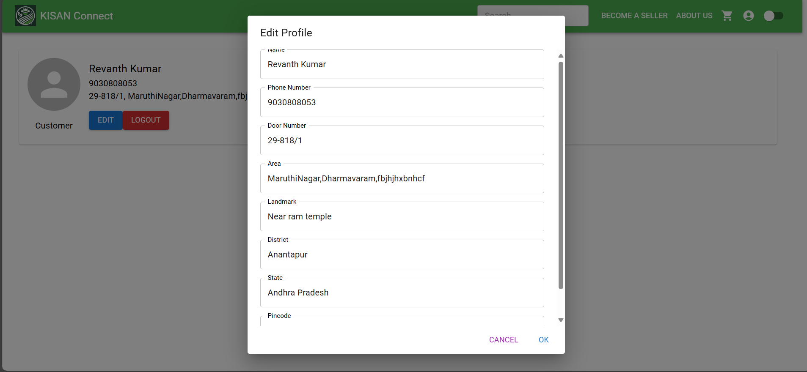
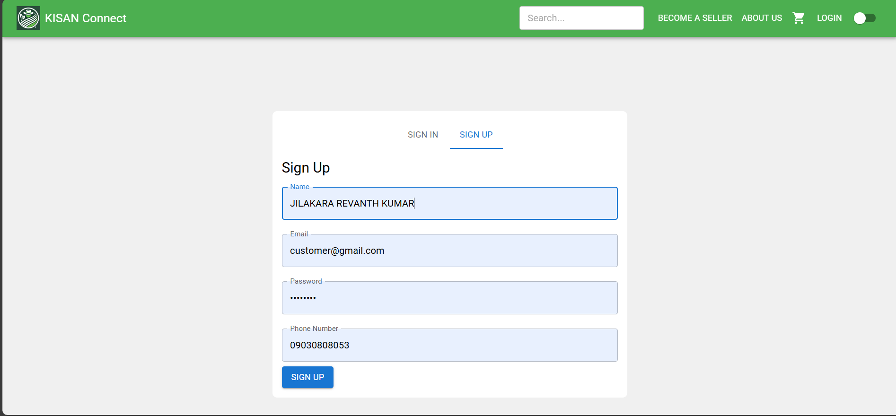
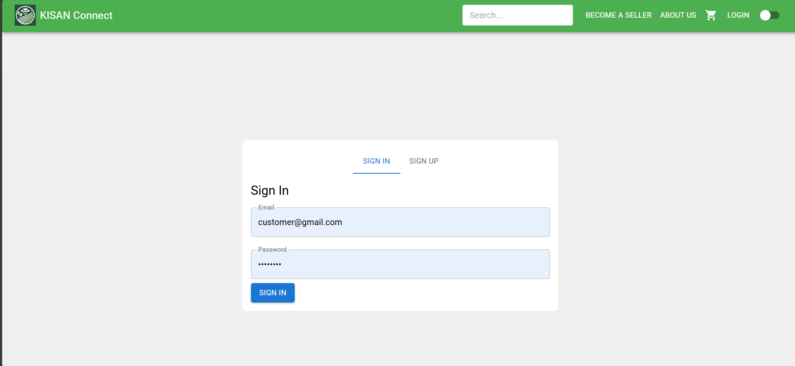

# Profile Page 👤

The **Profile** page allows customers to view, edit, and manage their personal information. Below are the key functionalities with corresponding images.

---

## 1. **View Profile**  
   - Displays the customer's personal information such as name, contact details, and shipping address.
   - Users can see their order history and other relevant data linked to their account.

---

## 2. **Edit Profile**  
   - Customers can update their personal information, such as name, email, phone number, and address.
   - Provides a form to change these details, ensuring the customer's account remains up to date.

---

## 3. **Signup**  
   - New customers can sign up for an account to access the platform and start browsing products.
   - The signup form requires the customer to provide essential details like name, email, and password.

---

## 4. **Login**  
   - Existing customers can log in to their account using their registered email and password.
   - The login form allows customers to access their profiles and purchase products.

---

### Summary  
The Profile page provides a seamless way for users to manage their account, update their personal information, and log in or sign up for an account.
