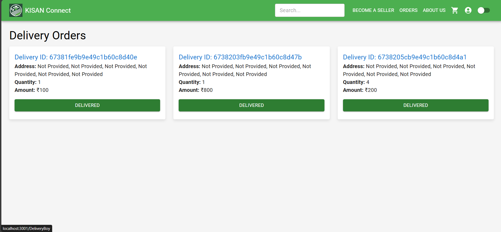

# Delivery Boy Page 🚚

The **Delivery Boy** interface allows delivery personnel to manage and track orders efficiently. Below are the key functionalities for delivery boys.

---

## 1. **Orders**  
   - Delivery boys can view all the pending orders that need to be delivered.  
   - The order list displays essential information like **Parcel ID**, **Amount**, and a **Delivered** button for each order.  
   - Once the order is delivered, the delivery boy can mark the order as delivered by clicking the **Delivered** button.

---

### Summary  
The **Delivery Boy Page** ensures that delivery personnel can easily track and manage their deliveries, marking orders as completed once delivered. It provides a simple and efficient way for delivery boys to fulfill their duties.
