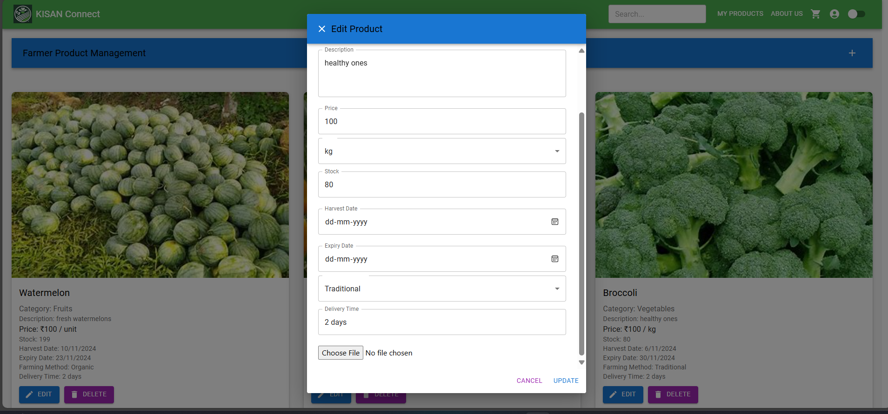

# Farmer Page 🌾

The **Farmer** interface allows farmers to manage their products, from adding new items to editing or deleting existing ones. Below are the key functionalities for farmers.

---

## 1. **Add Product**  
   - Farmers can add new agricultural products to the platform by providing details like product name, category, description, price, and uploading product images.
   - This feature helps farmers to list their fresh produce for sale.

---

## 2. **View All Products**  
   - Displays all the products listed by the farmer in a grid layout. 
   - Each product is shown with details like name, price, and description.
   - Farmers can **edit** or **delete** products directly from this page.

---

## 3. **Edit Product**  
   - Allows farmers to update information about their products, such as price, description, and images.
   - This page is accessible by clicking the **Edit** button on each product in the "View All Products" page.

---

### Summary  
The **Farmer Page** provides farmers with an intuitive interface to manage their products, ensuring they can easily add, edit, or remove their items from the platform.
